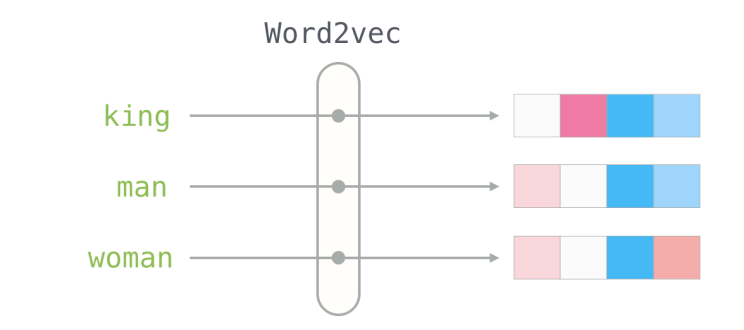
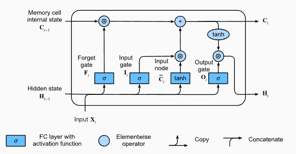

Ever wondered how ChatGPT was made? I did too, and this led me to a rabbit-hole of learning. In order to understand how we get to transformers, we first need to understand what came before it.

After reading through Andrej Karpathy's blog post on [The Unreasonable Effectiveness of Recurrent Neural Networks](https://karpathy.github.io/2015/05/21/rnn-effectiveness/), and attending [Prof. Fatih Nayebi, Ph.D.'s](https://www.linkedin.com/in/thefatih/) class on LSTMs, I wanted to try building one on my own, working through all the multiplications and state management.

In this post, I attempt to break down the workings of a multi-layer LSTM in an easy-to-understand manner. I assume that the reader has a basic understanding of deep learning, in that they know what a neural network is and how they are trained.

I used the famous Shakespeare dataset, which contains all the works of Shakespeare in a single file.

## But what is a LSTM / RNN?

RNN stands for Recurrent Neural Network, and is one of the major types of neural network architectures, especially when dealing with sequential data such as time-series or text-based. Unlike traditional feed-forward networks that connect everything to everything, RNNs have an added dimension of time.

This means that inputs are looked at in sequence, similar to how humans perceive information when reading something new - you start from the beginning of the text and keep moving forward, with your understanding updating as you read more.

This is made possible by utilizing something known as the "hidden state", which gets passed on as the network progress through time.

LSTM, short for [Long Short-Term Memory](https://en.wikipedia.org/wiki/Long_short-term_memory), is a special type of RNN, aimed at solving problems associated with a vanilla RNN. The biggest difference (and the only difference, in fact) lies in the hidden state of the LSTM, which is composed of two things:

1. A short-term memory (pertaining to the current timestep, often denoted by $h$)
2. A long-term memory (persisting across timesteps, often denoted by $c$)

With some complicated mathematics, the network learns to decide the values of $h$ and $c$ to get to a minimum loss in a specified amount of training time.

This is one of the earliest implementation of memory in neural networks, and for a large amount of time (before the "Attention Is All You Need" paper made transformers popular), LSTMs were the de-facto standard for NLP and deep learning.

## Preprocessing the data

To make things clearer, let's look at an example. After loading the Shakespeare dataset, I convert each character into a unique integer and add methods to convert between representations (hereafter called encoding/decoding). With that, I then define the dataset that will give me training examples and expected outputs. For instance, a training batch could look like:

- Input: First Cit -> Output: i
- Input: First Citi -> Output: z
- Input: First Citiz -> Output: e
- Input: First Citize -> Output: n

Notice how each sample has an sequence of inputs, and the output is the next character. In practice, instead of text, computers see numbers (more on this below).

This same principle is applied over the entire dataset which generates close to ~1M training samples (depending on the chosen sequence length).

## Word embeddings

Before we train the model, we first need to create embeddings for the characters. This means that instead of having a single number represent each character, we will have a vector of numbers represent each character, which will allow the model to learn more complex relationships between characters. To learn more about embeddings, see this [wonderful post by Jay Alammar](https://jalammar.github.io/illustrated-word2vec/).

The math behind embeddings is simple: For each token in the batch, we use an embedding layer to map the token index to a dense vector of the size of the embedding dimension.

## The LSTM Cell

The LSTM architecture is designed to learn long-term dependencies in sequences. It has a memory cells that can store information over varying time periods.

What makes LSTMs so performant is that it implements two versions of the memory, namely the short-term memory (what the model is currently looking at, $h$) and the long-term memory ($c$).

The gates in the LSTM cell control the flow of information in the computational graph. Through this, each cell can interpolate between the short-term and long-term memory, and decide what information to keep and what to discard. Let's look at the gates:

### LSTM cell gates

- **Forget gate**: This gate decides what information to keep and what to discard from the long-term memory. It takes the input token ($x_t$) and the hidden state from the previous time step ($h_{t-1}$) as input, and outputs a vector of values between 0 and 1 that are used to scale the long-term memory, essentially deciding what to forget (close to 0) and what to keep (close to 1).

- **Input gate**: This gate combines information from the input token and the hidden state from the previous time step, and decides what new information to add to the long-term memory. Here, the input token is passed through a sigmoid function to decide what to add to the long-term memory, and a tanh function to decide what to add.

- **Output gate**: This gate decides what information to take from the long-term memory and pass to the short-term memory. The output gate also takes $x_t$ and $h_{t-1}$ as input and outputs a vector to scale the long-term memory's contribution to the short-term memory.

Mathematically, the flow of an LSTM cell can be described as follows:

$$
\begin{align*}
f_t &= \sigma(W_f \cdot [x_t, h_{t-1}] + b_f) \\
i_t &= \sigma(W_i \cdot [x_t, h_{t-1}] + b_i) \\
o_t &= \sigma(W_o \cdot [x_t, h_{t-1}] + b_o) \\
g_t &= \tanh(W_g \cdot [x_t, h_{t-1}] + b_g) \\

\\

c_t &= f_t \odot c_{t-1} + i_t \odot g_t \\
h_t &= o_t \odot \tanh(c_t)
\end{align*}
$$

The W and b tensors represent the weights and biases for each gate respectively, while the circular operator denotes an element-wise multiplication (as opposed to matrix multiplication).

## Multi-layer LSTM

The above equations describe a single-layer LSTM cell. In practice, you stack multiple LSTM cells on top of each other to create a multi-layer LSTM. The output of the LSTM cell at each layer is passed as input to the LSTM cell at the next layer. This allows the model to learn more complex relationships in the data.

As you can see, the hidden state output at each time step for a layer becomes the input at the same time step to the next layer.

### Time-layer axis

If we think about it differently, a multi-layer LSTM essentially has two axes on which it operates.

1. Time axis (left to right): $t-1, t, t+1$, and so on
2. Layer axis (bottom to up): $L_0, L_1, L_2$, and so on

When you train the model, you start at $L_0$, process all the timesteps and save the hidden states. These hidden states then get passed on as inputs to $L_1$, which process all timesteps again, but this time, operating only on the hidden states of the layer below. It is important to note here that the cells in $L_1$ and above never look at the input data directly.

## Fully-connected layer

Finally, we need to add a fully-connected layer to the model to map the output of the LSTM cell to the vocabulary size.
Within the LSTM layer, neurons are connected to each other in a sequence, but the fully-connected layer connects all the input neurons to all the output neurons. This is probably the simplest layer in the model, and it is used to map the output of the LSTM cell to the vocabulary size, which is the number of unique characters in the text.

## Conclusion

And that's it. With these three (or four components): embeddings, LSTM, and fully connected layer, you have a complete neural network that can learn to generate text in the style of Shakespeare.

Thank you for reading! I hope the above was enjoyable and you learned something from it. A detailed notebook with the code will be available on my [GitHub profile](https://github.com/lakshyaag/Deep-Learning-From-Scratch).
