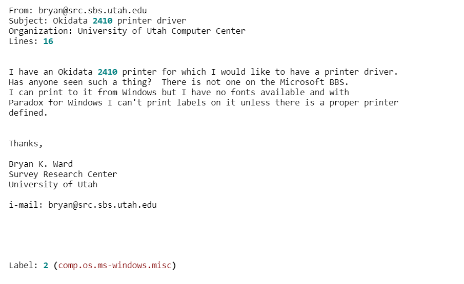
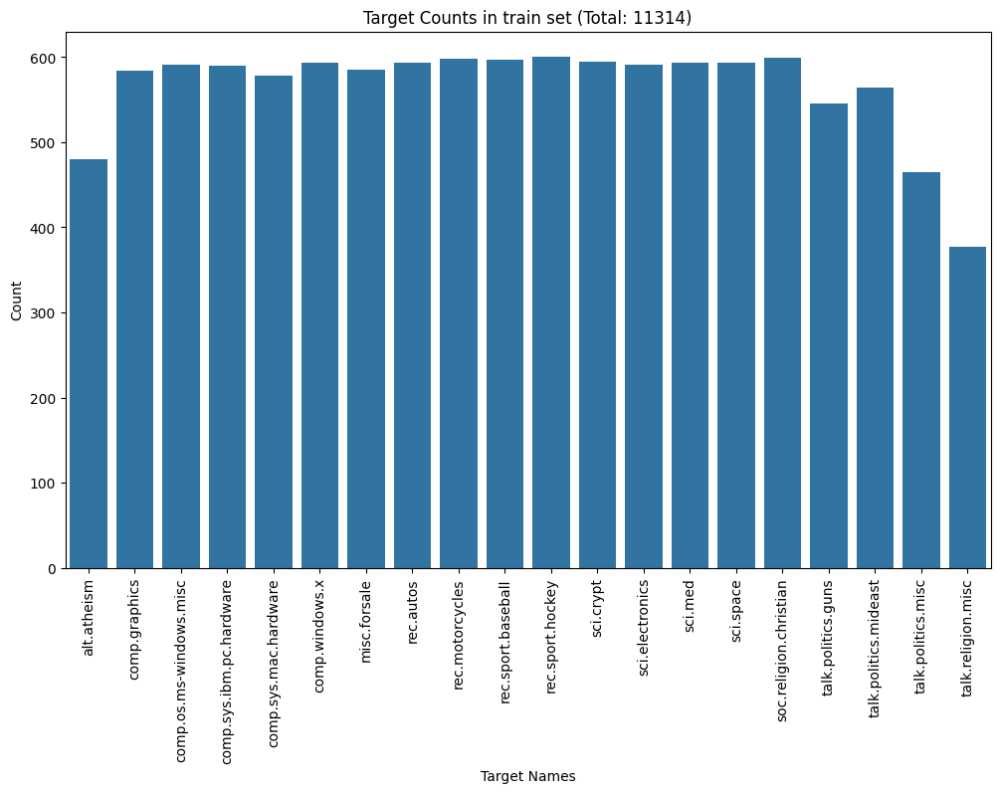
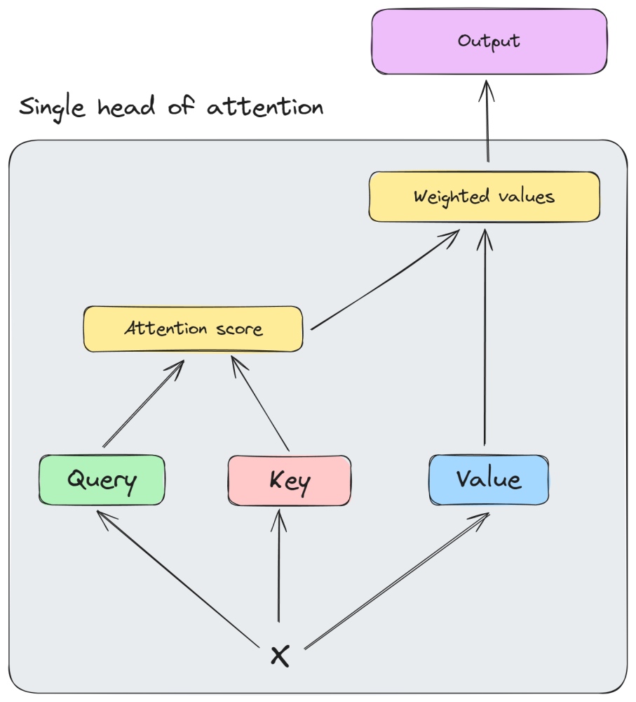
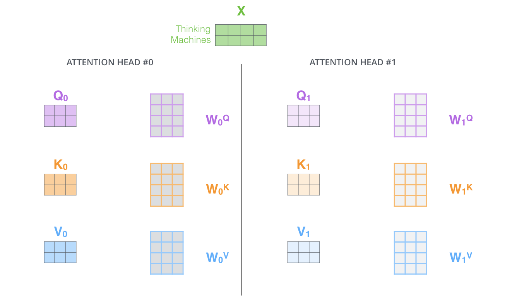
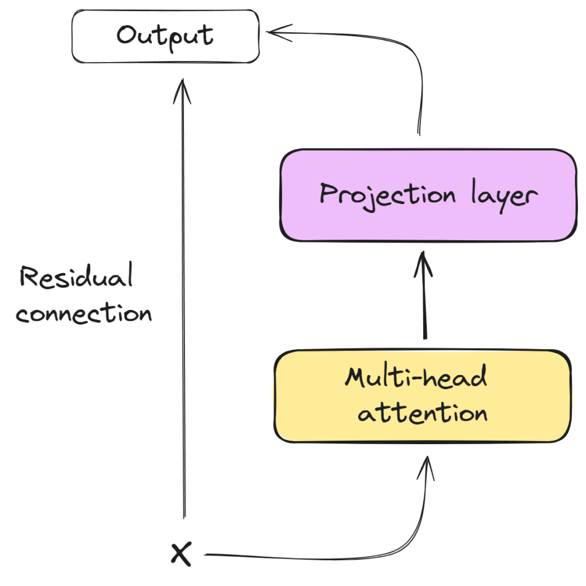

It's no surprise to anyone that transformer-based models have bought a seismic shift in the way text data is handled. These models, such as GPT-2 for instance, are models with a general understanding of the data they were trained on (which is most of the Internet). This property allows us to further improve the model by taking the pre-trained knowledge and adding a specific task to boost performance there.

In this post, I will attempt to explain the basic idea on how we can add a custom attention layer and a classification head on top of a pre-trained GPT-2 model. The larger objective is to provide to the readers an intuitive explanation of why this works, and how these things can be looked at as LEGO blocks that can be stacked and connected to each other.

## Dataset

Before looking at the architecture, let's quickly go through the dataset.

I use the famous [20 newsgroups dataset](http://qwone.com/~jason/20Newsgroups/), which comprises around 18000 newsgroups posts on 20 topics split into the training and testing sets. A sample is shown below:



The objective is to fine-tune GPT-2 such that it takes in an article (as above) as input and predicts the news group category (out of 20). The categories in the training set are evenly distributed:



## Tokenization

The first step when dealing with text data is to convert them into a numerical representation. In one of my [earlier articles on LSTM](https://lakshyaag.com/blogs/lstm-from-scratch), we saw that we can use word embeddings to achieve this. In this case, we will use the same idea, but instead of training a new embedding layer, we will import the tokenizer used by GPT-2 from HuggingFace. I will not go into the details of this as it's a whole another field, but I will recommend Andrej Karpathy's video on building a byte-pair encoding (BPE) tokenizer, which you can find [here](https://youtu.be/zduSFxRajkE).

> Technical note: We are dealing with transformer models, which process all inputs at once. To improve the performance, we must ensure that all inputs are of the same length through padding and attention masks to ensure that we do not waste computation power on empty spaces.

## Attention mechanism

At the heart of transformer models like GPT-2 is the attention mechanism. The attention mechanism allows each token to look and learn from a number of other tokens (in theory, infinitely many). Self-attention is the method the Transformer uses to [bake the “understanding”](https://jalammar.github.io/illustrated-transformer/#:~:text=Self%2Dattention%20is%20the%20method%20the%20Transformer%20uses%20to%20bake%20the%20%E2%80%9Cunderstanding%E2%80%9D%20of%20other%20relevant%20words%20into%20the%20one%20we%E2%80%99re%20currently%20processing.) of other relevant units into the unit that we are currently processing.

This might sound complex, but let's break it down into simpler terms. At the heart of it, attention refers to how much information to take and from where to take among all the tokens provided to it.

As an analogy, think of attention like a spotlight on a stage with a play where multiple actors are performing. The spotlight (attention mechanism) can move around to highlight different actors (words) based on their importance in the scene. The audience (the model) can then focus on the highlighted actors to understand the story better.

### How attention works



Each attention head in the model computes three vectors known as query, key, and value, calculates an attention score, and finally provides an output vector. Breaking it down in simpler terms, each attention head is made up of two key circuits (this is heavily inspired by [Anthropic's paper](https://transformer-circuits.pub/2021/framework/index.html)):

1. QK Circuit: This circuit determines where to move information to and from. It describes how much a given query token "wants" to attend to a given key token.
2. OV Circuit: This circuit determines what information to move. It describes how a given token will affect the output logits if attended to.

For more technical details, I invite the reader to go through Jay Alammar's excellent visual overview in ["The Illustrated Transformer"](https://jalammar.github.io/illustrated-transformer/) or see Andrej Karpathy's video on [building GPT-2 from scratch](https://www.youtube.com/watch?v=kCc8FmEb1nY).

### Scaling up to multi-head attention

The above explanation was for a single head of attention. In practice, we usually add multiple such heads to allow tokens to look at more than one token in parallel, each with its own independent set of Q/K/V parameters.



### Projection layer

Once the attention layer computes how much and where to take information from, it goes through a linear layer that performs computation, reasoning, lookup, etc. to build understanding of the language, using the non-linear activation function.

## Transformer block

Combining the multi-headed attention with the projection layer creates a single transformer block, which takes in a sequence of tokens and outputs a representation. This is aided by layer normalization and residual connections to make the training process stable, but I will not go too deep into the technical specifications here.



## Classification head

With the transformer blocks in place, we add a final linear layer that takes in the hidden state and outputs a vector of size equal to the number of classes. The final model architecture looks like below:


## Training process

I used the following set of hyperparameters to run the training process:

```python3
BATCH_SIZE = 16
MAX_LENGTH = 512
LEARNING_RATE = 1e-5
N_EMBED = 768
N_HEADS = 2
N_BLOCKS = 12
DROPOUT = 0.2
```

The final model had 139M parameters and after 5 epochs of training on Kaggle's P100 GPU, the test set had a loss of 0.96 and a classification accuracy of 78%. For reference, the benchmark on PapersWithCode is 89.5% with RoBERTaGCN. I believe by tuning the hyperparameters and training for longer, the above architecture could be improved by a lot.

## Example classification

Let's look at an example from the test set and how the model predicts on it

```plaintext
From: Rick Miller <rick@ee.uwm.edu>
Subject: X-Face?
Organization: Just me.
Lines: 17
Distribution: world
NNTP-Posting-Host: 129.89.2.33
Summary: Go ahead... swamp me.  <EEP!>

I'm not familiar at all with the format of these "X-Face:" thingies, but
after seeing them in some folks' headers, I've *got* to *see* them (and
maybe make one of my own)!

I've got "dpg-view" on my Linux box (which displays "uncompressed X-Faces")
and I've managed to compile compface too... but now that I'm *looking*
for them, I can't seem to find any X-Face:'s in anyones news headers!  :-(

Could you, would you, please send me your "X-Face:" header?

I *know* I'll probably get a little swamped, but I can handle it.

        ...I hope.

Rick Miller  <rick@ee.uwm.edu> | <ricxjo@discus.mil.wi.us>   Ricxjo Muelisto
Send a postcard, get one back! | Enposxtigu bildkarton kaj vi ricevos alion!
          RICK MILLER // 16203 WOODS // MUSKEGO, WIS. 53150 // USA
```

The model correctly predicts the news group, which in this case, is _"comp.windows.x"_.

## Conclusion

By fine-tuning GPT-2 with a custom self-attention layer and classifier head, we achieved a classification accuracy of 78% on the 20 Newsgroups dataset. This project demonstrates the versatility of transformer models like GPT-2, which can be adapted for various NLP tasks such as classification, summarization, or industry-specific instructions.

Thank you for reading! I hope the above was enjoyable and you learned something from it. A detailed notebook with the code will be available on my [GitHub profile](https://github.com/lakshyaag/Deep-Learning-From-Scratch).
